# Application Flow & User Journeys (02_AppFlow.md)
## RemediQ - Dual-Purpose Practice Management System
*(Classical Homeopathy, General Medicine & Integrative Clinics)*

**Document Version:** 3.0  
**Target Environment:** Laravel 11 + Inertia.js v2 + React 18  
**Status Legend:**  
- `[x] Done`: Implemented, tested, and active in production code.  
- `[ ] Planned`: Planned workflow gap to be implemented.

---

## 1. High-Level System Architecture Flow

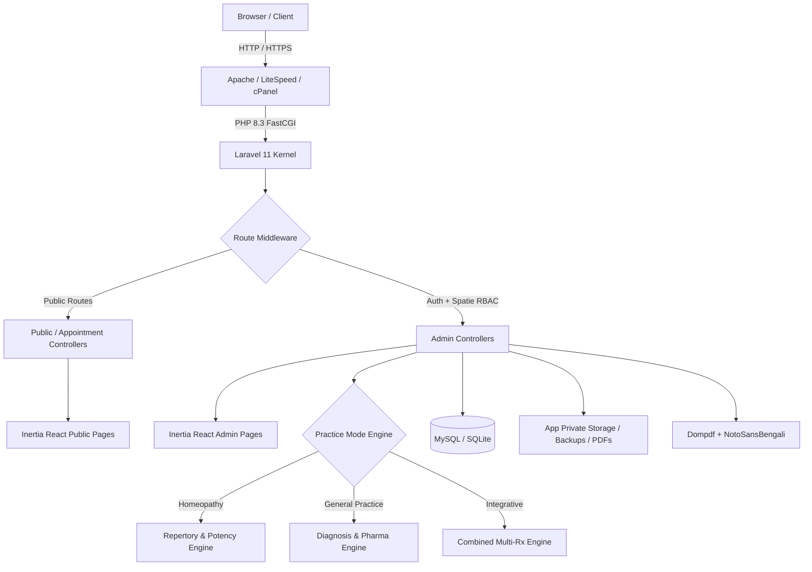
```mermaid
graph TD
    Client[Browser / Client] -->|HTTP / HTTPS| WebServer[Apache / LiteSpeed / cPanel]
    WebServer -->|PHP 8.3 FastCGI| LaravelCore[Laravel 11 Kernel]
    
    LaravelCore --> RouteMiddleware{Route Middleware}
    RouteMiddleware -->|Public Routes| PublicControllers[Public / Appointment Controllers]
    RouteMiddleware -->|Auth + Spatie RBAC| AdminControllers[Admin Controllers]
    
    PublicControllers --> PublicReact[Inertia React Public Pages]
    AdminControllers --> AdminReact[Inertia React Admin Pages]
    
    AdminControllers --> PracticeAdapter{Practice Mode Engine}
    PracticeAdapter -->|Homeopathy| HomeoEngine[Repertory & Potency Engine]
    PracticeAdapter -->|General Practice| GeneralEngine[Diagnosis & Pharma Engine]
    PracticeAdapter -->|Integrative| DualEngine[Combined Multi-Rx Engine]
    
    AdminControllers --> Database[(MySQL / SQLite)]
    AdminControllers --> PrivateStorage[App Private Storage / Backups / PDFs]
    AdminControllers --> Dompdf[Dompdf + NotoSansBengali]
```

---

## 2. Receptionist & Patient Intake Journey (`[x] Done`)

Universal intake journey for all practice types (Homeopathy, General Practice, Dental, Polyclinic).

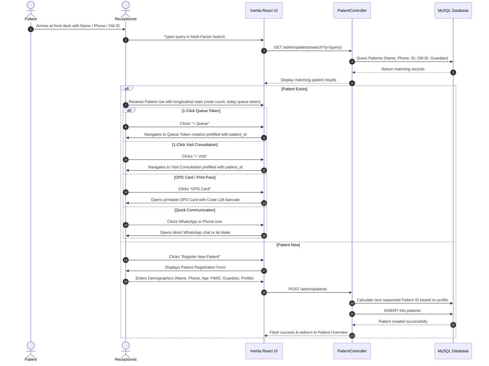
```mermaid
sequenceDiagram
    autonumber
    actor Patient
    actor Receptionist
    participant UI as Inertia React UI
    participant PatientCtrl as PatientController
    participant DB as MySQL Database

    Patient->>Receptionist: Arrives at front desk with Name / Phone / Old ID
    Receptionist->>UI: Types query in Multi-Factor Search
    UI->>PatientCtrl: GET /admin/patients/search?q={query}
    PatientCtrl->>DB: Query Patients (Name, Phone, ID, Old ID, Guardian)
    DB-->>PatientCtrl: Return matching records
    PatientCtrl-->>UI: Display matching patient results

    alt Patient Exists
        Receptionist->>UI: Reviews Patient row with longitudinal stats (visits count, today queue token)
        alt 1-Click Queue Token
            Receptionist->>UI: Clicks "+ Queue"
            UI->>Receptionist: Navigates to Queue Token creation prefilled with patient_id
        else 1-Click Visit Consultation
            Receptionist->>UI: Clicks "+ Visit"
            UI->>Receptionist: Navigates to Visit Consultation prefilled with patient_id
        else OPD Card / Print Pass
            Receptionist->>UI: Clicks "OPD Card"
            UI->>Receptionist: Opens printable OPD Card with Code-128 barcode
        else Quick Communication
            Receptionist->>UI: Clicks WhatsApp or Phone icon
            UI->>Receptionist: Opens direct WhatsApp chat or tel dialer
        end
    else Patient New
        Receptionist->>UI: Clicks "Register New Patient"
        UI->>Receptionist: Displays Patient Registration Form
        Receptionist->>UI: Enters Demographics (Name, Phone, Age Y/M/D, Guardian, Profile)
        UI->>PatientCtrl: POST /admin/patients
        PatientCtrl->>DB: Calculate next sequential Patient ID based on profile
        PatientCtrl->>DB: INSERT into patients
        DB-->>PatientCtrl: Patient created successfully
        PatientCtrl-->>UI: Flash success & redirect to Patient Overview
    end
```

---

## 3. Dual Clinical Consultation Journeys

The doctor's consultation experience adapts dynamically to the clinic's configured practice mode or doctor specialty:

```mermaid
flowchart TD
    StartConsult([Doctor Starts Consultation]) --> SelectPat[Select Patient on /admin/visits/create]
    SelectPat --> LongContext[Display Longitudinal Context: Total Visits, Last Visit Date, Today's Queue Token]
    LongContext --> AutoLinkToken[Auto-Link Today's Token ID to Visit Payload]
    AutoLinkToken --> AutoHist[Auto-Populate Medical History & Allergies in Chief Complaints]
    AutoHist --> CheckPast[Inspect Clinical History Drawer & Repeat Last Rx if Follow-up]
    CheckPast --> CheckMode{Practice Mode}
    
    %% Homeopathy Path
    CheckMode -- Homeopathy Mode --> HomeoWorkbench[Homeopathic Consultation]
    HomeoWorkbench --> CollectGenerals[Physical Generals & Modalities]
    HomeoWorkbench --> SelectRubrics[Select Rubrics from Symptoms Catalog]
    SelectRubrics --> AutoRepertorize[System Suggests Remedies by Grade]
    AutoRepertorize --> PrescribeRemedy[Add Remedies, Potency 30C/200C/LM, Dosage]
    PrescribeRemedy --> AddDietary[Add Food Restrictions & Dietary Advice]
    AddDietary --> FinalizeCommon[Review & Finalize Consultation]

    %% General Practice / Allopathy Path
    CheckMode -- General Practice Mode --> AllopathWorkbench[General Medicine Consultation]
    AllopathWorkbench --> RecordVitals[Record Vitals: BP, Pulse, Temp, Sugar, Weight]
    RecordVitals --> RecordDiagnosis[Enter Clinical Diagnosis ICD/Free Text]
    RecordDiagnosis --> PrescribePharma[Prescribe Generic/Brand Drug + Strength + Form]
    PrescribePharma --> OrderLabs[Order Diagnostic Lab Tests CBC, USG, X-Ray]
    OrderLabs --> FinalizeCommon

    %% Integrative Path
    CheckMode -- Integrative Mode --> DualWorkbench[Dual Integrative Consultation]
    DualWorkbench --> RecordVitals
    DualWorkbench --> SelectRubrics
    DualWorkbench --> RecordDiagnosis
    DualWorkbench --> PrescribeCombined[Prescribe Homeopathic Remedies & Conventional Rx]
    DualWorkbench --> FinalizeCommon

    %% Finalization
    FinalizeCommon --> LockRecord[Write to visits + prescription_items]
    LockRecord --> AuditTrail[Log activity in activity_log]
    AuditTrail --> PDFGen[Render Bilingual PDF with NotoSansBengali]
    PDFGen --> PDFOutput([Official Printed Prescription])
    PDFOutput --> PostConsultRegistry[Visits Directory & Clinical Log /admin/visits]
```

### 3.1 Post-Consultation Workflow & Visits Directory (`/admin/visits`)

Once finalized, the clinical encounter enters the central consultation directory:

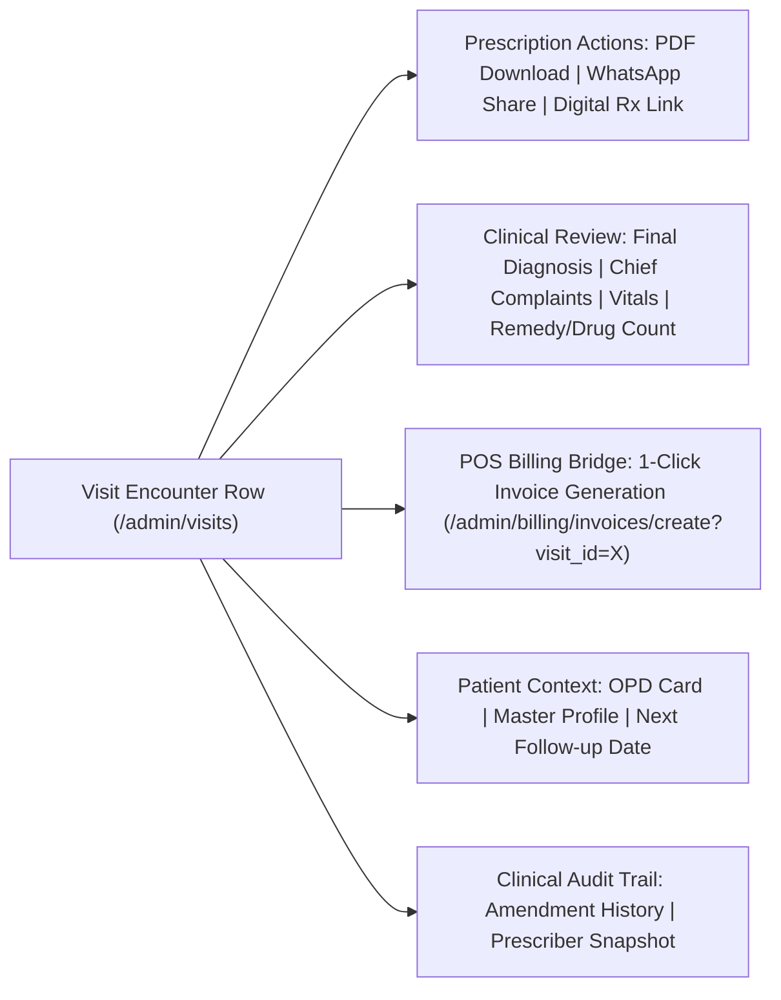
```mermaid
flowchart LR
    VisitRow["Visit Encounter Row (/admin/visits)"] --> RxActions["Prescription Actions: PDF Download | WhatsApp Share | Digital Rx Link"]
    VisitRow --> ClinicalReview["Clinical Review: Final Diagnosis | Chief Complaints | Vitals | Remedy/Drug Count"]
    VisitRow --> POSBilling["POS Billing Bridge: 1-Click Invoice Generation (/admin/billing/invoices/create?visit_id=X)"]
    VisitRow --> PatientNav["Patient Context: OPD Card | Master Profile | Next Follow-up Date"]
    VisitRow --> AuditLog["Clinical Audit Trail: Amendment History | Prescriber Snapshot"]
```

---

## 4. Prescription Amendment & Cancellation Workflow (`[x] Done`)

Preserves legal clinical integrity across all practice types.

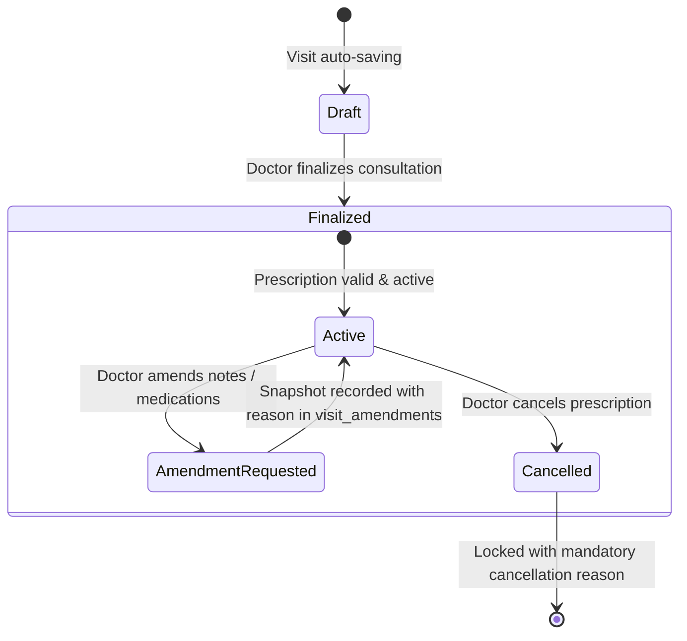
```mermaid
stateDiagram-v2
    [*] --> Draft : Visit auto-saving
    Draft --> Finalized : Doctor finalizes consultation
    
    state Finalized {
        [*] --> Active : Prescription valid & active
        Active --> AmendmentRequested : Doctor amends notes / medications
        AmendmentRequested --> Active : Snapshot recorded with reason in visit_amendments
        Active --> Cancelled : Doctor cancels prescription
    }
    
    Cancelled --> [*] : Locked with mandatory cancellation reason
```

---

## 5. Online Appointment Request to Patient Conversion (`[x] Done`)

Unified appointment triage supporting doctors across all specialties.

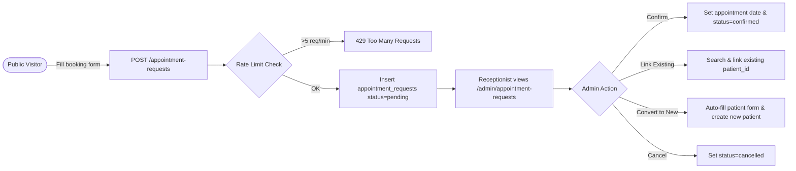
```mermaid
flowchart LR
    PublicUser([Public Visitor]) -->|Fill booking form| SubmitForm[POST /appointment-requests]
    SubmitForm --> RateLimit{Rate Limit Check}
    RateLimit -- >5 req/min --> Reject[429 Too Many Requests]
    RateLimit -- OK --> SaveReq[Insert appointment_requests status=pending]
    
    SaveReq --> AdminView[Receptionist views /admin/appointment-requests]
    AdminView --> ActionChoice{Admin Action}
    
    ActionChoice -- Confirm --> SetSchedule[Set appointment date & status=confirmed]
    ActionChoice -- Link Existing --> LinkPatient[Search & link existing patient_id]
    ActionChoice -- Convert to New --> ConvertNew[Auto-fill patient form & create new patient]
    ActionChoice -- Cancel --> RejectReq[Set status=cancelled]
```

### 5.1 Admin Appointment Requests & Triage Operations Flow (`/admin/appointment-requests`)

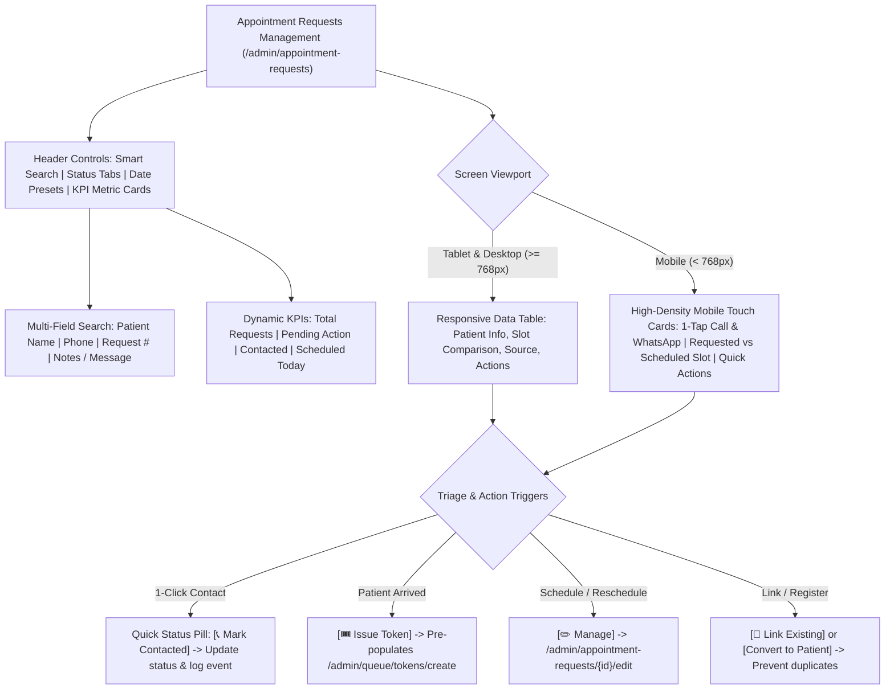
```mermaid
flowchart TD
    ApptHome["Appointment Requests Management (/admin/appointment-requests)"] --> FilterBar["Header Controls: Smart Search | Status Tabs | Date Presets | KPI Metric Cards"]
    
    FilterBar --> SearchEngine["Multi-Field Search: Patient Name | Phone | Request # | Notes / Message"]
    FilterBar --> KPICards["Dynamic KPIs: Total Requests | Pending Action | Contacted | Scheduled Today"]
    
    ApptHome --> ScreenMode{"Screen Viewport"}
    
    ScreenMode -->|"Mobile (< 768px)"| MobileCards["High-Density Mobile Touch Cards: 1-Tap Call & WhatsApp | Requested vs Scheduled Slot | Quick Actions"]
    ScreenMode -->|"Tablet & Desktop (>= 768px)"| DesktopTable["Responsive Data Table: Patient Info, Slot Comparison, Source, Actions"]
    
    DesktopTable --> QuickTriage{"Triage & Action Triggers"}
    MobileCards --> QuickTriage
    
    QuickTriage -->|"1-Click Contact"| QuickContact["Quick Status Pill: [📞 Mark Contacted] -> Update status & log event"]
    QuickTriage -->|"Patient Arrived"| QuickToken["[🎟️ Issue Token] -> Pre-populates /admin/queue/tokens/create"]
    QuickTriage -->|"Schedule / Reschedule"| ManageEdit["[✏️ Manage] -> /admin/appointment-requests/{id}/edit"]
    QuickTriage -->|"Link / Register"| PatientSync["[👤 Link Existing] or [Convert to Patient] -> Prevent duplicates"]
```

### 5.2 Staff Appointment Intake & Fast-Track Booking Flow (`/admin/appointment-requests/create`)

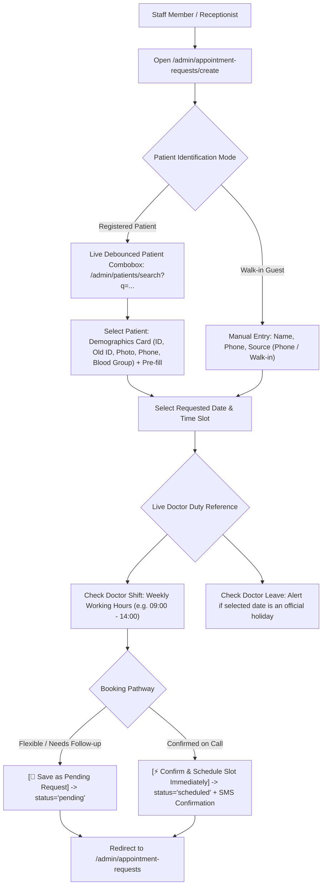
```mermaid
flowchart TD
    Staff["Staff Member / Receptionist"] --> OpenIntake["Open /admin/appointment-requests/create"]
    OpenIntake --> ModeSelect{"Patient Identification Mode"}
    
    ModeSelect -->|"Registered Patient"| SearchPatient["Live Debounced Patient Combobox: /admin/patients/search?q=..."]
    SearchPatient --> SelectPatient["Select Patient: Demographics Card (ID, Old ID, Photo, Phone, Blood Group) + Pre-fill"]
    ModeSelect -->|"Walk-in Guest"| ManualEntry["Manual Entry: Name, Phone, Source (Phone / Walk-in)"]
    
    SelectPatient --> SlotSelect["Select Requested Date & Time Slot"]
    ManualEntry --> SlotSelect
    
    SlotSelect --> DocRoster{"Live Doctor Duty Reference"}
    DocRoster --> CheckShift["Check Doctor Shift: Weekly Working Hours (e.g. 09:00 - 14:00)"]
    DocRoster --> CheckHoliday["Check Doctor Leave: Alert if selected date is an official holiday"]
    
    CheckShift --> BookingAction{"Booking Pathway"}
    BookingAction -->|"Flexible / Needs Follow-up"| SavePending["[📝 Save as Pending Request] -> status='pending'"]
    BookingAction -->|"Confirmed on Call"| SaveScheduled["[⚡ Confirm & Schedule Slot Immediately] -> status='scheduled' + SMS Confirmation"]
    
    SavePending --> RedirectList["Redirect to /admin/appointment-requests"]
    SaveScheduled --> RedirectList
```

---

## 6. System Health, In-App Backup & Deployment Flow (`[x] Done`)

Server administration workflow tailored for cPanel hosting without SSH.

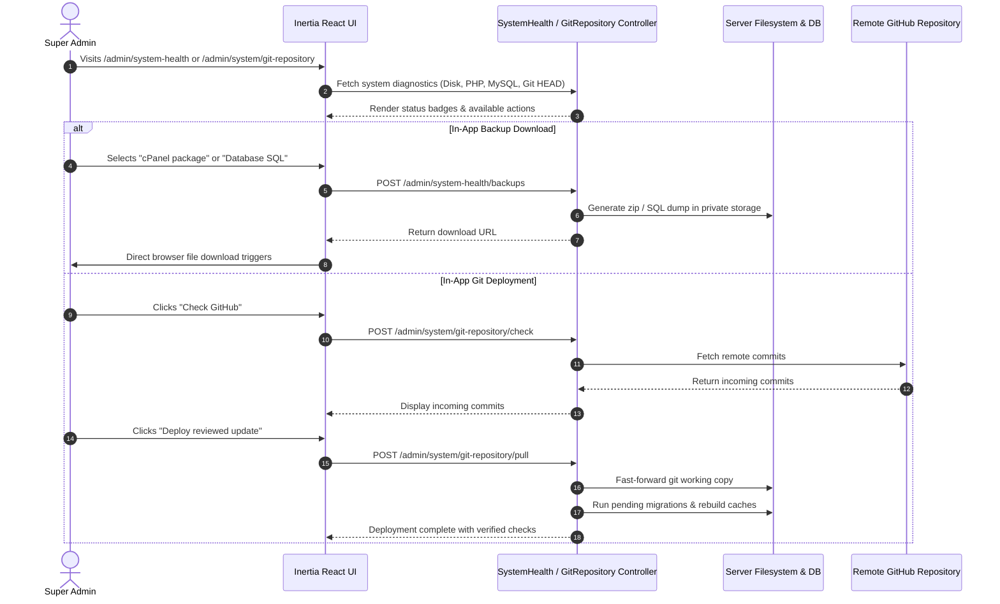
```mermaid
sequenceDiagram
    autonumber
    actor SuperAdmin as Super Admin
    participant UI as Inertia React UI
    participant SysCtrl as SystemHealth / GitRepository Controller
    participant Storage as Server Filesystem & DB
    participant GitHub as Remote GitHub Repository

    SuperAdmin->>UI: Visits /admin/system-health or /admin/system/git-repository
    UI->>SysCtrl: Fetch system diagnostics (Disk, PHP, MySQL, Git HEAD)
    SysCtrl-->>UI: Render status badges & available actions

    alt In-App Backup Download
        SuperAdmin->>UI: Selects "cPanel package" or "Database SQL"
        UI->>SysCtrl: POST /admin/system-health/backups
        SysCtrl->>Storage: Generate zip / SQL dump in private storage
        SysCtrl-->>UI: Return download URL
        UI->>SuperAdmin: Direct browser file download triggers
    else In-App Git Deployment
        SuperAdmin->>UI: Clicks "Check GitHub"
        UI->>SysCtrl: POST /admin/system/git-repository/check
        SysCtrl->>GitHub: Fetch remote commits
        GitHub-->>SysCtrl: Return incoming commits
        SysCtrl-->>UI: Display incoming commits
        SuperAdmin->>UI: Clicks "Deploy reviewed update"
        UI->>SysCtrl: POST /admin/system/git-repository/pull
        SysCtrl->>Storage: Fast-forward git working copy
        SysCtrl->>Storage: Run pending migrations & rebuild caches
        SysCtrl-->>UI: Deployment complete with verified checks
    end
```

---

## 7. Pharmacy Dispensing & Inventory Deduction Flow (`[x] Done`)

Dual pharmacy dispensing workflow handling both homeopathic and conventional medications:

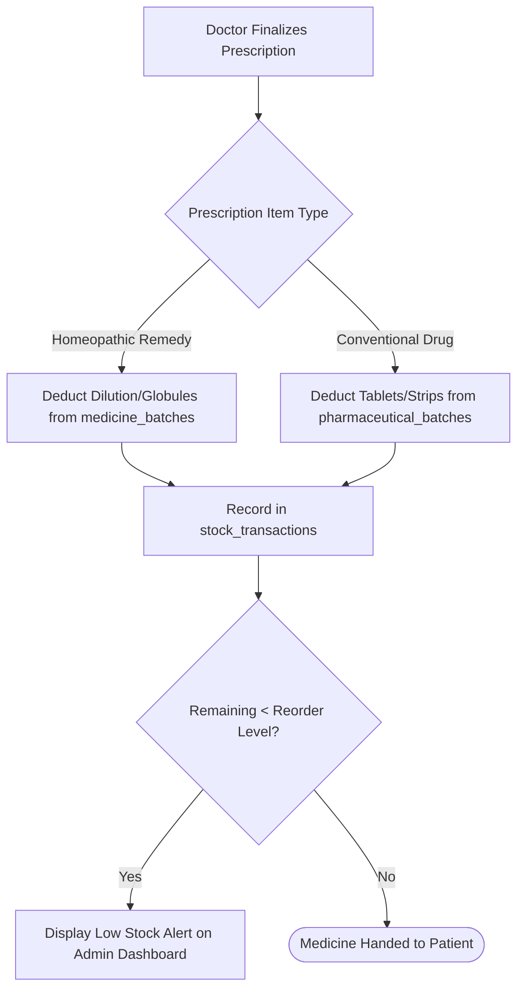
```mermaid
flowchart TD
    DoctorFinalizes[Doctor Finalizes Prescription] --> CheckItemType{Prescription Item Type}
    
    CheckItemType -- Homeopathic Remedy --> DeductHomeo[Deduct Dilution/Globules from medicine_batches]
    CheckItemType -- Conventional Drug --> DeductPharma[Deduct Tablets/Strips from pharmaceutical_batches]
    
    DeductHomeo --> StockLedger[Record in stock_transactions]
    DeductPharma --> StockLedger
    
    StockLedger --> LowStockCheck{Remaining < Reorder Level?}
    LowStockCheck -- Yes --> AlertBadge[Display Low Stock Alert on Admin Dashboard]
    LowStockCheck -- No --> FinishDispense([Medicine Handed to Patient])
```

---

### 7.1 Homeopathic Medicine Catalog & Pharmacopoeia Flow (`/admin/medicines`)

Master clinical pharmacopoeia management, multi-nomenclature search, potency scale classification, and batch inventory synchronization:

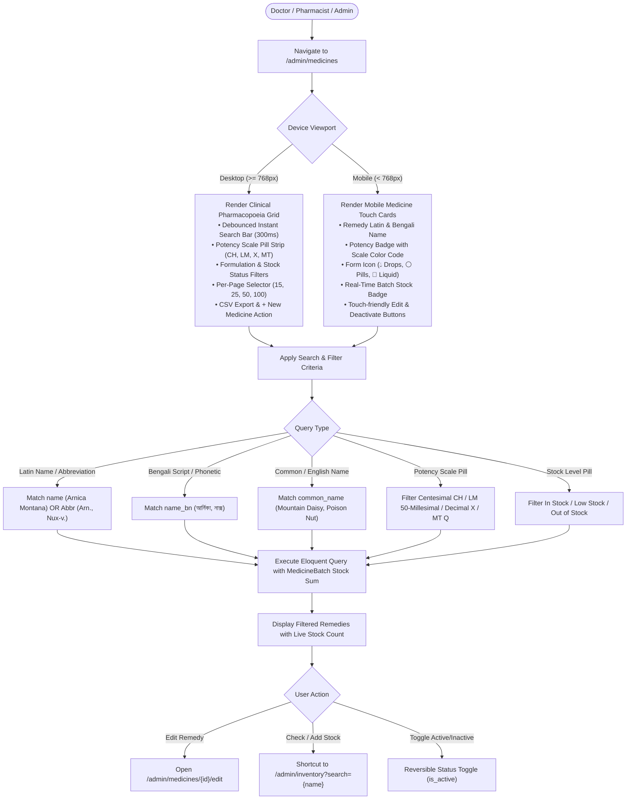
```mermaid
flowchart TD
    User([Doctor / Pharmacist / Admin]) --> OpenCatalog["Navigate to /admin/medicines"]
    OpenCatalog --> ViewMode{"Device Viewport"}
    
    ViewMode -- "Mobile (< 768px)" --> MobileView["Render Mobile Medicine Touch Cards<br/>• Remedy Latin & Bengali Name<br/>• Potency Badge with Scale Color Code<br/>• Form Icon (💧 Drops, ⚪ Pills, 🧪 Liquid)<br/>• Real-Time Batch Stock Badge<br/>• Touch-friendly Edit & Deactivate Buttons"]
    ViewMode -- "Desktop (>= 768px)" --> DesktopView["Render Clinical Pharmacopoeia Grid<br/>• Debounced Instant Search Bar (300ms)<br/>• Potency Scale Pill Strip (CH, LM, X, MT)<br/>• Formulation & Stock Status Filters<br/>• Per-Page Selector (15, 25, 50, 100)<br/>• CSV Export & + New Medicine Action"]
    
    DesktopView --> SearchOrFilter["Apply Search & Filter Criteria"]
    MobileView --> SearchOrFilter
    
    SearchOrFilter --> MultiMatch{"Query Type"}
    MultiMatch -- "Latin Name / Abbreviation" --> QueryName["Match name (Arnica Montana) OR Abbr (Arn., Nux-v.)"]
    MultiMatch -- "Bengali Script / Phonetic" --> QueryBn["Match name_bn (আর্নিকা, নাক্স)"]
    MultiMatch -- "Common / English Name" --> QueryCommon["Match common_name (Mountain Daisy, Poison Nut)"]
    MultiMatch -- "Potency Scale Pill" --> QueryScale["Filter Centesimal CH / LM 50-Millesimal / Decimal X / MT Q"]
    MultiMatch -- "Stock Level Pill" --> QueryStock["Filter In Stock / Low Stock / Out of Stock"]
    
    QueryName --> AggregateQuery["Execute Eloquent Query with MedicineBatch Stock Sum"]
    QueryBn --> AggregateQuery
    QueryCommon --> AggregateQuery
    QueryScale --> AggregateQuery
    QueryStock --> AggregateQuery
    
    AggregateQuery --> LiveResults["Display Filtered Remedies with Live Stock Count"]
    LiveResults --> ClickAction{"User Action"}
    ClickAction -- "Edit Remedy" --> EditForm["Open /admin/medicines/{id}/edit"]
    ClickAction -- "Check / Add Stock" --> JumpInventory["Shortcut to /admin/inventory?search={name}"]
    ClickAction -- "Toggle Active/Inactive" --> SoftDeactivate["Reversible Status Toggle (is_active)"]
```

---

### 7.2 Allopathic Pharmaceuticals Catalog & Formulary Flow (`/admin/pharmaceuticals`)

Conventional pharmaceutical formulary management, multi-parameter search, dosage form classification, and batch inventory synchronization:

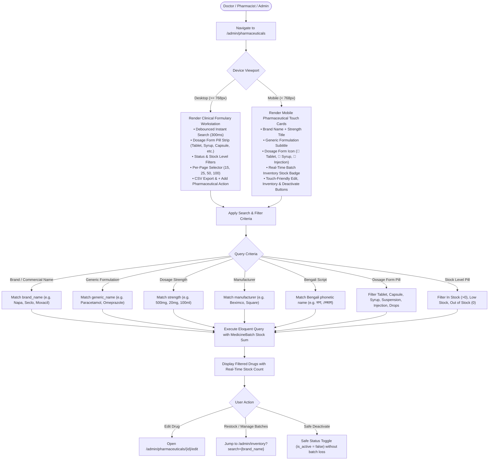
```mermaid
flowchart TD
    User([Doctor / Pharmacist / Admin]) --> OpenPharma["Navigate to /admin/pharmaceuticals"]
    OpenPharma --> ViewMode{"Device Viewport"}
    
    ViewMode -- "Mobile (< 768px)" --> MobileView["Render Mobile Pharmaceutical Touch Cards<br/>• Brand Name + Strength Title<br/>• Generic Formulation Subtitle<br/>• Dosage Form Icon (💊 Tablet, 🧪 Syrup, 💉 Injection)<br/>• Real-Time Batch Inventory Stock Badge<br/>• Touch-Friendly Edit, Inventory & Deactivate Buttons"]
    ViewMode -- "Desktop (>= 768px)" --> DesktopView["Render Clinical Formulary Workstation<br/>• Debounced Instant Search (300ms)<br/>• Dosage Form Pill Strip (Tablet, Syrup, Capsule, etc.)<br/>• Status & Stock Level Filters<br/>• Per-Page Selector (15, 25, 50, 100)<br/>• CSV Export & + Add Pharmaceutical Action"]
    
    DesktopView --> SearchOrFilter["Apply Search & Filter Criteria"]
    MobileView --> SearchOrFilter
    
    SearchOrFilter --> MatchCriteria{"Query Criteria"}
    MatchCriteria -- "Brand / Commercial Name" --> MatchBrand["Match brand_name (e.g. Napa, Seclo, Moxacil)"]
    MatchCriteria -- "Generic Formulation" --> MatchGeneric["Match generic_name (e.g. Paracetamol, Omeprazole)"]
    MatchCriteria -- "Dosage Strength" --> MatchStrength["Match strength (e.g. 500mg, 20mg, 100ml)"]
    MatchCriteria -- "Manufacturer" --> MatchMfr["Match manufacturer (e.g. Beximco, Square)"]
    MatchCriteria -- "Bengali Script" --> MatchBn["Match Bengali phonetic name (e.g. নাপা, সেকলো)"]
    MatchCriteria -- "Dosage Form Pill" --> FilterForm["Filter Tablet, Capsule, Syrup, Suspension, Injection, Drops"]
    MatchCriteria -- "Stock Level Pill" --> FilterStock["Filter In Stock (>0), Low Stock, Out of Stock (0)"]
    
    MatchBrand --> ExecuteQuery["Execute Eloquent Query with MedicineBatch Stock Sum"]
    MatchGeneric --> ExecuteQuery
    MatchStrength --> ExecuteQuery
    MatchMfr --> ExecuteQuery
    MatchBn --> ExecuteQuery
    FilterForm --> ExecuteQuery
    FilterStock --> ExecuteQuery
    
    ExecuteQuery --> RenderResults["Display Filtered Drugs with Real-Time Stock Count"]
    RenderResults --> UserAction{"User Action"}
    UserAction -- "Edit Drug" --> EditDrug["Open /admin/pharmaceuticals/{id}/edit"]
    UserAction -- "Restock / Manage Batches" --> JumpStock["Jump to /admin/inventory?search={brand_name}"]
    UserAction -- "Safe Deactivate" --> SafeDeactivate["Safe Status Toggle (is_active = false) without batch loss"]
```

---

### 7.3 Allopathic Pharmaceutical Drug Creation & Formulary Intake Workflow (`/admin/pharmaceuticals/create`)

Drug onboarding, bilingual formulation, dosage classification, and atomic opening inventory batch intake:

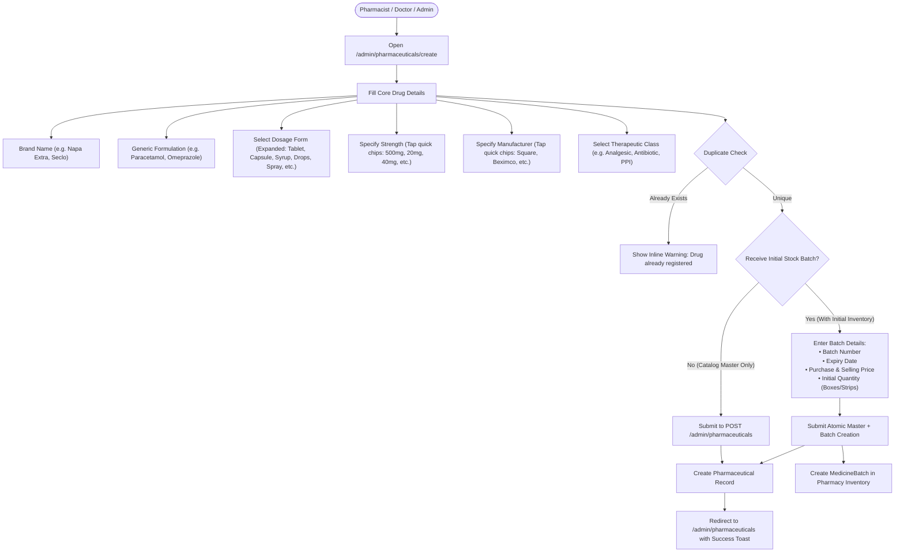
```mermaid
flowchart TD
    User([Pharmacist / Doctor / Admin]) --> OpenCreate["Open /admin/pharmaceuticals/create"]
    
    OpenCreate --> InputFields["Fill Core Drug Details"]
    InputFields --> Brand["Brand Name (e.g. Napa Extra, Seclo)"]
    InputFields --> Generic["Generic Formulation (e.g. Paracetamol, Omeprazole)"]
    InputFields --> DosageForm["Select Dosage Form (Expanded: Tablet, Capsule, Syrup, Drops, Spray, etc.)"]
    InputFields --> Strength["Specify Strength (Tap quick chips: 500mg, 20mg, 40mg, etc.)"]
    InputFields --> Mfr["Specify Manufacturer (Tap quick chips: Square, Beximco, etc.)"]
    InputFields --> Category["Select Therapeutic Class (e.g. Analgesic, Antibiotic, PPI)"]
    
    InputFields --> DupCheck{"Duplicate Check"}
    DupCheck -- "Already Exists" --> AlertDup["Show Inline Warning: Drug already registered"]
    DupCheck -- "Unique" --> BatchToggle{"Receive Initial Stock Batch?"}
    
    BatchToggle -- "No (Catalog Master Only)" --> SubmitMaster["Submit to POST /admin/pharmaceuticals"]
    BatchToggle -- "Yes (With Initial Inventory)" --> BatchFields["Enter Batch Details:<br/>• Batch Number<br/>• Expiry Date<br/>• Purchase & Selling Price<br/>• Initial Quantity (Boxes/Strips)"]
    
    BatchFields --> SubmitAtomic["Submit Atomic Master + Batch Creation"]
    SubmitMaster --> SaveMaster["Create Pharmaceutical Record"]
    SubmitAtomic --> SaveMaster
    SubmitAtomic --> SaveBatch["Create MedicineBatch in Pharmacy Inventory"]
    
    SaveMaster --> Redirect["Redirect to /admin/pharmaceuticals with Success Toast"]
```

---

### 7.4 Pharmacy Multi-Batch Inventory & Stock Control Workstation (`/admin/inventory`)

Dual pharmacy stock management, multi-attribute search, FEFO batch rotation, and inline stock adjustment:

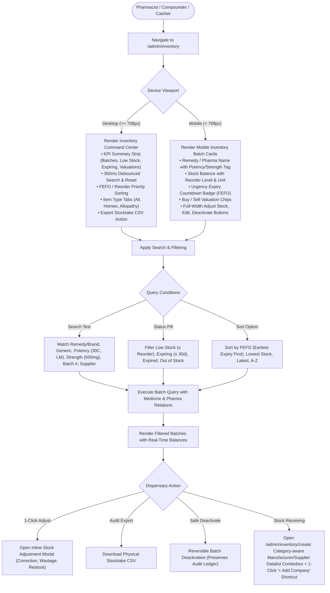
```mermaid
flowchart TD
    User([Pharmacist / Compounder / Cashier]) --> OpenInventory["Navigate to /admin/inventory"]
    OpenInventory --> ViewMode{"Device Viewport"}
    
    ViewMode -- "Mobile (< 768px)" --> MobileCards["Render Mobile Inventory Batch Cards<br/>• Remedy / Pharma Name with Potency/Strength Tag<br/>• Stock Balance with Reorder Level & Unit<br/>• Urgency Expiry Countdown Badge (FEFO)<br/>• Buy / Sell Valuation Chips<br/>• Full-Width Adjust Stock, Edit, Deactivate Buttons"]
    ViewMode -- "Desktop (>= 768px)" --> DesktopTable["Render Inventory Command Center<br/>• KPI Summary Strip (Batches, Low Stock, Expiring, Valuations)<br/>• 300ms Debounced Search & Reset<br/>• FEFO / Reorder Priority Sorting<br/>• Item Type Tabs (All, Homeo, Allopathy)<br/>• Export Stocktake CSV Action"]
    
    DesktopTable --> ApplySearch["Apply Search & Filtering"]
    MobileCards --> ApplySearch
    
    ApplySearch --> MatchFilter{"Query Conditions"}
    MatchFilter -- "Search Text" --> MatchAttrs["Match Remedy/Brand, Generic, Potency (30C, LM), Strength (500mg), Batch #, Supplier"]
    MatchFilter -- "Status Pill" --> MatchStatus["Filter Low Stock (≤ Reorder), Expiring (≤ 30d), Expired, Out of Stock"]
    MatchFilter -- "Sort Option" --> MatchSort["Sort by FEFO (Earliest Expiry First), Lowest Stock, Latest, A-Z"]
    
    MatchAttrs --> ExecuteQuery["Execute Batch Query with Medicine & Pharma Relations"]
    MatchStatus --> ExecuteQuery
    MatchSort --> ExecuteQuery
    
    ExecuteQuery --> DisplayResults["Render Filtered Batches with Real-Time Balances"]
    DisplayResults --> Action{"Dispensary Action"}
    Action -- "1-Click Adjust" --> OpenModal["Open Inline Stock Adjustment Modal (Correction, Wastage, Restock)"]
    Action -- "Audit Export" --> DownloadCSV["Download Physical Stocktake CSV"]
    Action -- "Safe Deactivate" --> SoftDeactivate["Reversible Batch Deactivation (Preserves Audit Ledger)"]
    Action -- "Stock Receiving" --> StockReceive["Open /admin/inventory/create: Category-aware Manufacturer/Supplier Datalist Combobox + 1-Click '+ Add Company' Shortcut"]
```

---

### 7.5 Pharmaceutical & Remedy Manufacturer Master Management (`/admin/manufacturers`) (`[x] Done`)

Multi-disciplinary pharmaceutical and remedy manufacturer directory, Medical Representative (MR) contact management, and drug formulary intake integration:

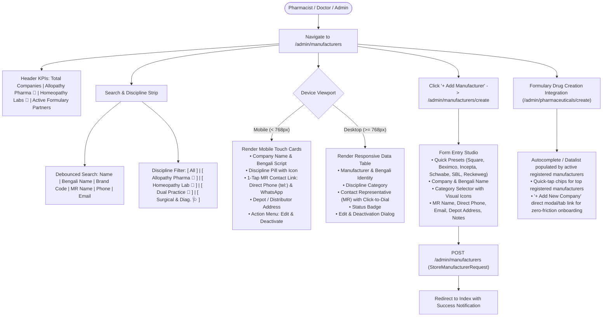
```mermaid
flowchart TD
    User([Pharmacist / Doctor / Admin]) --> MfrHome["Navigate to /admin/manufacturers"]
    
    MfrHome --> HeaderMetrics["Header KPIs: Total Companies | Allopathy Pharma 💊 | Homeopathy Labs 🌿 | Active Formulary Partners"]
    
    MfrHome --> FilterControls["Search & Discipline Strip"]
    FilterControls --> DebouncedSearch["Debounced Search: Name | Bengali Name | Brand Code | MR Name | Phone | Email"]
    FilterControls --> TypeFilter["Discipline Filter: [ All ] | [ Allopathy Pharma 💊 ] | [ Homeopathy Lab 🌿 ] | [ Dual Practice 🏥 ] | [ Surgical & Diag. 🩺 ]"]
    
    MfrHome --> ViewMode{"Device Viewport"}
    ViewMode -- "Mobile (< 768px)" --> MobileCards["Render Mobile Touch Cards<br/>• Company Name & Bengali Script<br/>• Discipline Pill with Icon<br/>• 1-Tap MR Contact Link: Direct Phone (tel:) & WhatsApp<br/>• Depot / Distributor Address<br/>• Action Menu: Edit & Deactivate"]
    ViewMode -- "Desktop (>= 768px)" --> DesktopTable["Render Responsive Data Table<br/>• Manufacturer & Bengali Identity<br/>• Discipline Category<br/>• Contact Representative (MR) with Click-to-Dial<br/>• Status Badge<br/>• Edit & Deactivation Dialog"]
    
    MfrHome --> AddCompany["Click '+ Add Manufacturer' -> /admin/manufacturers/create"]
    AddCompany --> IntakeForm["Form Entry Studio<br/>• Quick Presets (Square, Beximco, Incepta, Schwabe, SBL, Reckeweg)<br/>• Company & Bengali Name<br/>• Category Selector with Visual Icons<br/>• MR Name, Direct Phone, Email, Depot Address, Notes"]
    IntakeForm --> SubmitStore["POST /admin/manufacturers (StoreManufacturerRequest)"]
    SubmitStore --> SuccessRedirect["Redirect to Index with Success Notification"]
    
    MfrHome --> DrugFormulary["Formulary Drug Creation Integration (/admin/pharmaceuticals/create)"]
    DrugFormulary --> SelectMfr["Autocomplete / Datalist populated by active registered manufacturers<br/>• Quick-tap chips for top registered manufacturers<br/>• '+ Add New Company' direct modal/tab link for zero-friction onboarding"]
```

---

## 8. Billing, Invoicing & Cash Register Flow (`[x] Done`)

Universal point-of-sale workflow for consultation fees, medicines, and lab tests:

```mermaid
flowchart TD
    PatientVisits([Patient Finishes Consultation / Dispensary]) --> BillingCounter[Front Desk / Billing Desk]
    BillingCounter --> CreateInvoice[Open /admin/billing/create?patient_id=...]
    
    CreateInvoice --> PopulateItems[Load items: Doctor Consultation + Medicines + Ordered Tests]
    PopulateItems --> AdjustDiscounts[Apply discounts or waivers if authorized]
    
    AdjustDiscounts --> SelectPayment{Payment Method}
    SelectPayment -- Cash --> RecordCash[Record Cash Received & Tendered Change]
    SelectPayment -- bKash / Nagad --> RecordMFS[Record Transaction ID & Phone]
    SelectPayment -- Card --> RecordCard[Record Card Authorization Code]
    
    RecordCash --> SaveInvoice[Save Invoice status=PAID]
    RecordMFS --> SaveInvoice
    RecordCard --> SaveInvoice
    
    SaveInvoice --> PrintSlip[Print 80mm Thermal Receipt or A5 Invoice]
    PrintSlip --> DailyLedger[Invoice added to Daily Cash Reconciliation Report]
```

### 8.1 Invoices Directory, Search Engine & Cashier Operations Flow (`/admin/invoices`)

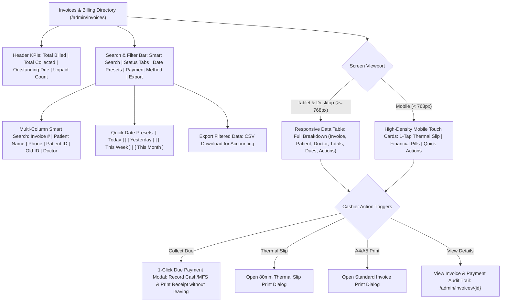
```mermaid
flowchart TD
    InvHome["Invoices & Billing Directory (/admin/invoices)"] --> HeaderKPIs["Header KPIs: Total Billed | Total Collected | Outstanding Due | Unpaid Count"]
    
    InvHome --> Controls["Search & Filter Bar: Smart Search | Status Tabs | Date Presets | Payment Method | Export"]
    
    Controls --> SearchEngine["Multi-Column Smart Search: Invoice # | Patient Name | Phone | Patient ID | Old ID | Doctor"]
    Controls --> DatePills["Quick Date Presets: [ Today ] | [ Yesterday ] | [ This Week ] | [ This Month ]"]
    Controls --> ExportCSV["Export Filtered Data: CSV Download for Accounting"]
    
    InvHome --> ScreenMode{"Screen Viewport"}
    
    ScreenMode -->|"Mobile (< 768px)"| MobileCards["High-Density Mobile Touch Cards: 1-Tap Thermal Slip | Financial Pills | Quick Actions"]
    ScreenMode -->|"Tablet & Desktop (>= 768px)"| DesktopTable["Responsive Data Table: Full Breakdown (Invoice, Patient, Doctor, Totals, Dues, Actions)"]
    
    DesktopTable --> CashierActions{"Cashier Action Triggers"}
    MobileCards --> CashierActions
    
    CashierActions -->|"Collect Due"| DueModal["1-Click Due Payment Modal: Record Cash/MFS & Print Receipt without leaving"]
    CashierActions -->|"Thermal Slip"| PrintPOS["Open 80mm Thermal Slip Print Dialog"]
    CashierActions -->|"A4/A5 Print"| PrintFull["Open Standard Invoice Print Dialog"]
    CashierActions -->|"View Details"| ViewDetail["View Invoice & Payment Audit Trail: /admin/invoices/{id}"]
```

### 8.2 Point-of-Sale (POS) Invoice Creation & Cashier Checkout Flow (`/admin/invoices/create`)

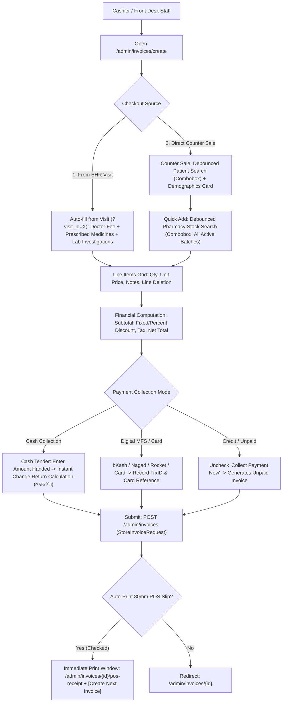
```mermaid
flowchart TD
    Cashier["Cashier / Front Desk Staff"] --> OpenCreate["Open /admin/invoices/create"]
    
    OpenCreate --> SourcePathway{"Checkout Source"}
    
    SourcePathway -->|"1. From EHR Visit"| AutoImport["Auto-fill from Visit (?visit_id=X): Doctor Fee + Prescribed Medicines + Lab Investigations"]
    SourcePathway -->|"2. Direct Counter Sale"| CounterSale["Counter Sale: Debounced Patient Search (Combobox) + Demographics Card"]
    
    AutoImport --> ItemCustomization["Line Items Grid: Qty, Unit Price, Notes, Line Deletion"]
    CounterSale --> AddPharmacy["Quick Add: Debounced Pharmacy Stock Search (Combobox: All Active Batches)"]
    AddPharmacy --> ItemCustomization
    
    ItemCustomization --> Calculations["Financial Computation: Subtotal, Fixed/Percent Discount, Tax, Net Total"]
    
    Calculations --> PaymentTender{"Payment Collection Mode"}
    PaymentTender -->|"Credit / Unpaid"| SkipPayment["Uncheck 'Collect Payment Now' -> Generates Unpaid Invoice"]
    PaymentTender -->|"Cash Collection"| CashDrawer["Cash Tender: Enter Amount Handed -> Instant Change Return Calculation (ফেরত দিন)"]
    PaymentTender -->|"Digital MFS / Card"| DigitalPay["bKash / Nagad / Rocket / Card -> Record TrxID & Card Reference"]
    
    CashDrawer --> SubmitInvoice["Submit: POST /admin/invoices (StoreInvoiceRequest)"]
    DigitalPay --> SubmitInvoice
    SkipPayment --> SubmitInvoice
    
    SubmitInvoice --> PrintDecision{"Auto-Print 80mm POS Slip?"}
    PrintDecision -->|"Yes (Checked)"| OpenPOS["Immediate Print Window: /admin/invoices/{id}/pos-receipt + [Create Next Invoice]"]
    PrintDecision -->|"No"| ViewInvoice["Redirect: /admin/invoices/{id}"]
```

---

## 9. Patient Queue Management & Digital Signage Flow (`[x] Done`)

Waiting room live queue and digital TV display workflow:

```mermaid
flowchart TD
    PatientArrives([Patient Arrives / Appointment Checked-in]) --> ReceptionDesk[Front Desk Receptionist]
    ReceptionDesk --> IssueToken[Issue Queue Token: Sequential T-001 + Chamber]
    IssueToken --> PrintSlip[Print 80mm Thermal Token Slip for Patient]
    
    IssueToken --> TVDisplay[Waiting Room Live TV Board: /queue/display]
    TVDisplay --> WaitQueue[Token Listed in 'Next In Line / অপেক্ষমাণ']
    
    DoctorChamber([Doctor at Workbench]) --> ClickCall[Doctor Clicks 'Call Next Patient']
    ClickCall --> StateCalling[Token Status = calling]
    StateCalling --> TVHeroCall[TV Display Pulses 'NOW CALLING' with Chime & Speech]
    StateCalling --> MaskedName[Patient Name Displayed with Privacy Masking]
    
    PatientEnters([Patient Enters Chamber]) --> StartConsult[Doctor Clicks 'Patient Entered Chamber']
    StartConsult --> StateConsult[Token Status = in_consultation]
    StartConsult --> OpenRx[Doctor Opens Prescription Builder]
    
    FinishRx([Prescription Finalized]) --> AutoComplete[Token Status = completed]
```

### 9.1 Multi-Screen Queue Operations & Reception Dashboard Flow (`/admin/queue`)

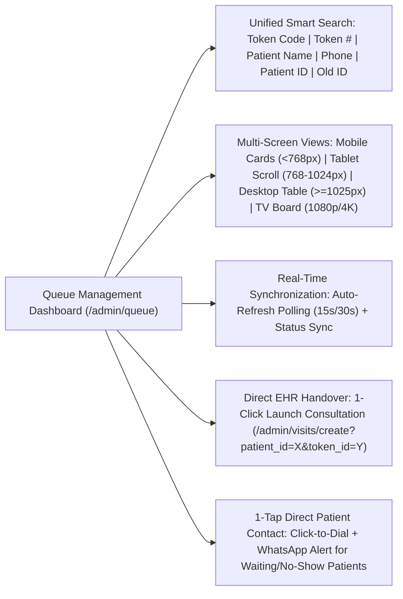
```mermaid
flowchart LR
    QueueHome["Queue Management Dashboard (/admin/queue)"] --> SearchEngine["Unified Smart Search: Token Code | Token # | Patient Name | Phone | Patient ID | Old ID"]
    QueueHome --> MultiScreen["Multi-Screen Views: Mobile Cards (<768px) | Tablet Scroll (768-1024px) | Desktop Table (>=1025px) | TV Board (1080p/4K)"]
    QueueHome --> LiveSync["Real-Time Synchronization: Auto-Refresh Polling (15s/30s) + Status Sync"]
    QueueHome --> DirectConsult["Direct EHR Handover: 1-Click Launch Consultation (/admin/visits/create?patient_id=X&token_id=Y)"]
    QueueHome --> PatientContact["1-Tap Direct Patient Contact: Click-to-Dial + WhatsApp Alert for Waiting/No-Show Patients"]
```

### 9.2 Token Issuance & Queue Check-in Flow (`/admin/queue/tokens/create`)

```mermaid
flowchart TD
    Start(["Front Desk / Check-in Arrival"]) --> Entry{"Entry Route"}
    
    Entry -->|"Preselected Link (?patient_id=4)"| LoadPatient["QueueController::create - Load Patient #4 Demographics"]
    Entry -->|"Walk-in Unregistered"| WalkInMode["Toggle Walk-in Guest Mode (Name + Phone)"]
    Entry -->|"Search Registered Patient"| AsyncSearch["Async Multi-Factor Search / Barcode Scan"]
    
    AsyncSearch --> MatchPatient["Select Existing Patient Record"]
    MatchPatient --> DemographicsCard["Render Patient Demographics Verification Card"]
    LoadPatient --> DemographicsCard
    
    DemographicsCard --> CheckActiveToken{"Active Token Today?"}
    CheckActiveToken -->|"Yes"| ConflictAlert["Display Duplicate Warning Banner + [Reprint Slip] + [Override Checkbox]"]
    CheckActiveToken -->|"No"| DoctorSelect["Select Doctor & Auto-Populate Chamber for Today"]
    
    ConflictAlert --> DoctorSelect
    
    DoctorSelect --> SetPriority["Set Priority: Normal (Green) vs Urgent (Red)"]
    SetPriority --> ActionChoice{"Submit Action"}
    
    ActionChoice -->|"Issue Token & Print Slip"| StoreAndPrint["POST /admin/queue/tokens -> Redirect to /admin/queue/tokens/{id}/print"]
    ActionChoice -->|"Issue & Start Consultation"| StoreAndConsult["POST /admin/queue/tokens?start_consultation=1 -> Redirect to /admin/visits/create"]
    
    StoreAndPrint --> ThermalSlip["80mm POS Thermal Slip (Auto Print Window)"]
    ThermalSlip --> BackToQueue["[Back to Queue] or [Issue Another Token]"]
    
    StoreAndConsult --> VisitWorkbench["Clinical Consultation & Prescription EHR Workbench"]
```

### 9.3 Doctor Schedules, Visual Calendar & Appointment Roster Flow (`/admin/calendar`)

```mermaid
flowchart TD
    CalHome["Doctor Visual Calendar (/admin/calendar)"] --> Controls["Top Bar: Month Navigation (Prev/Today/Next) | Doctor Filter | Event Type Filter | Smart Search"]
    
    Controls --> SearchEngine["Multi-Factor Smart Search: Patient Name | Phone | Patient ID | Old ID | Doctor | Chamber"]
    
    CalHome --> ScreenMode{"Screen Viewport"}
    
    ScreenMode -->|"Mobile (< 768px)"| MobileAgenda["Mobile Agenda Timeline View: Horizontal Day Carousel Ribbon + Vertical Event Stream + 1-Tap Dial/WA"]
    ScreenMode -->|"Desktop & Tablet (>= 768px)"| MonthGrid["Monthly 7-Col Matrix: Day Number, Doctor Shift Badges, Color-Coded Event Chips (Blue/Green/Red)"]
    
    MonthGrid --> DayClick["User Clicks Calendar Day Cell"]
    MobileAgenda --> DayClick
    
    DayClick --> DayModal["Interactive Day Schedule Modal: List Appointments, Visits, Doctor Leaves"]
    
    DayModal --> ActionChoice{"Quick Action Triggers"}
    ActionChoice -->|"Issue Token"| IssueToken["1-Click Token Check-in: /admin/queue/tokens/create?date=..."]
    ActionChoice -->|"Book Appointment"| BookAppt["1-Click Book Intake: /admin/appointment-requests/create?date=..."]
    ActionChoice -->|"Add Leave"| AddLeave["1-Click Doctor Holiday: /admin/doctor-schedules?doctor_id=X&date=..."]
    ActionChoice -->|"View Prescription"| ViewRx["View Finalized Prescription: /admin/visits/{id}"]
```

### 9.4 Doctor Visiting Hours, Chamber Roster & Leave Management Flow (`/admin/doctor-schedules`)

```mermaid
flowchart TD
    SetupHome["Doctor Visiting Schedules (/admin/doctor-schedules)"] --> DoctorSelect["Doctor Selector: Search Doctor | Doctor Tabs"]
    
    DoctorSelect --> DualPanel{"Module Area"}
    
    DualPanel -->|"Weekly Shifts"| WeeklyShifts["Weekly Visiting Hours Matrix (Sun-Sat)"]
    WeeklyShifts --> BulkCopy["[📋 Copy to All Weekdays] Accelerator"]
    WeeklyShifts --> ChamberPills["Chamber Room Quick Select (Chamber 1 | Chamber 2)"]
    WeeklyShifts --> SaveShifts["PUT /admin/doctor-schedules/{doctor} -> Update doctor_schedules"]
    
    DualPanel -->|"Leaves & Holidays"| LeaveManager["Doctor Leaves & Off-Days Manager"]
    LeaveManager --> SingleOrRange{"Leave Type"}
    SingleOrRange -->|"Single Day"| SingleDate["Select Single Date (e.g. 2026-12-05)"]
    SingleOrRange -->|"Date Range"| DateRange["Select Date Range: [From Date] to [To Date] (e.g. 2026-12-01 to 2026-12-07)"]
    
    SingleDate --> ConflictCheck{"Active Bookings on Date?"}
    DateRange --> ConflictCheck
    
    ConflictCheck -->|"Yes (Warning)"| ConflictWarn["Display Warning: '5 Appointments & 2 Tokens already booked' + [Proceed Anyway]"]
    ConflictCheck -->|"No"| StoreLeave["POST /admin/doctor-schedules/{doctor}/leaves -> Bulk insert into doctor_leaves"]
    ConflictWarn --> StoreLeave
    
    StoreLeave --> SyncFeeder["Syncs with: Visual Calendar (/admin/calendar) & Queue Token Auto-Chamber (/admin/queue/tokens/create)"]
```

---

## 10. Automated Patient Communications Flow (`[x] Done`)

Multi-channel notification dispatches and public digital prescription access:

```mermaid
flowchart TD
    TriggerEvent(["Clinical / Front Desk Event"]) --> CheckTrigger{"Event Type"}
    
    CheckTrigger -->|"Appointment Scheduled"| T1["Appointment Confirmation"]
    CheckTrigger -->|"Queue Token Issued"| T2["Token Serial Alert"]
    CheckTrigger -->|"Prescription Finalized"| T3["Prescription Ready & Public Link"]
    CheckTrigger -->|"Custom Direct Message"| T4["Ad-hoc Notification"]
    
    T1 --> FormatMsg["Render Template with Placeholders"]
    T2 --> FormatMsg
    T3 --> FormatMsg
    T4 --> DirectMsg["Custom Body"]
    
    FormatMsg --> SanitizePhone["Sanitize Phone (8801XXXXXXXXX)"]
    DirectMsg --> SanitizePhone
    
    SanitizePhone --> ChannelSelect{"Gateway Channel"}
    ChannelSelect -->|"SMS"| DispatchSMS["CommunicationService Driver (Log / GreenWeb / MimSMS)"]
    ChannelSelect -->|"WhatsApp"| GenerateURL["Generate Click-to-Chat WhatsApp URL"]
    
    DispatchSMS --> LogAudit["Audit Log in patient_notifications"]
    GenerateURL --> LogAudit
    
    LogAudit --> PatientReceives["Patient Receives Alert with Secure Share URL"]
    PatientReceives --> ViewPrescription["Public Patient View: /rx/{share_token}"]
    ViewPrescription --> DownloadPDF["Download Authentic Signed Prescription PDF: /rx/{share_token}/pdf"]
```

### 10.1 SMS Gateway Diagnostics, Balance Check & Template Configuration Flow (`/admin/communications/settings`)

```mermaid
flowchart TD
    SettingsHome["Communication Settings (/admin/communications/settings)"] --> DriverSetup["Gateway Driver Setup: Log | Greenweb | MimSMS | Generic REST"]
    
    DriverSetup --> AuthInputs["Enter API Credentials, Endpoint URL & Sender ID (Masking)"]
    
    AuthInputs --> LiveDiagnostics{"Live Vendor Diagnostics"}
    LiveDiagnostics -->|"Check Balance"| BalanceQuery["[🔍 Check Balance] -> Queries Vendor Balance API & Displays SMS Credits Remaining"]
    LiveDiagnostics -->|"Test Dispatch"| TestPing["[🚀 Send Test SMS] -> Test Mobile Number -> Immediate HTTP Response Display"]
    
    SettingsHome --> TemplateStudio["Interactive Message Template Studio"]
    TemplateStudio --> TokenInserter["Clickable Token Inserter: [+ Patient Name] [+ Doctor] [+ Date] [+ Rx Link]"]
    TemplateStudio --> CharacterCounter["Live GSM vs Unicode Billing Counter: X / 160 (GSM) vs X / 70 (Bengali Unicode)"]
    
    SettingsHome --> EventTriggers["Event Triggers: Appointments | Queue Tokens | Digital Rx | Billing Receipts"]
    
    TemplateStudio --> SaveConfig["PUT /admin/communications/settings -> Update clinic_settings.sms_config JSON"]
    EventTriggers --> SaveConfig
    SaveConfig --> ActiveDispatcher["Powers Automated SMS & WhatsApp Dispatches Throughout RemediQ"]
```

---

## 11. Clinical, Financial & Operational Analytics Reports Flow (`[x] Done`)

Multi-dimensional analytics suite for clinical volume, doctor performance, morbidity trends, and data export:

```mermaid
flowchart TD
    ReportsHome["Reports & Analytics Suite (/admin/reports)"] --> HeaderKPIs["Executive KPIs: Consultations | Unique Patients | Finalized Rx | Daily Average"]
    
    ReportsHome --> FilterBar["Filter Bar: Date Presets (Today/Week/Month/Year) | Doctor Filter | Smart Search | CSV Export"]
    
    ReportsHome --> ReportTabs{"Analytical Reporting Domain"}
    
    ReportTabs -->|"Consultations & Morbidity"| Tab1["Consultations Matrix: Date, Patient, Doctor, Complaint, Diagnoses, Status"]
    ReportTabs -->|"Doctor Performance"| Tab2["Doctor Productivity: Consultations per Doctor, New vs Follow-up, Finalized Visits"]
    ReportTabs -->|"Remedy Utilization"| Tab3["Pharmacy Insights: Top Prescribed Remedies (Homeopathic & Conventional)"]
    
    Tab1 --> ExportEngine{"Export & Print Triggers"}
    Tab2 --> ExportEngine
    Tab3 --> ExportEngine
    
    ExportEngine -->|"CSV Download"| ExportCSV["Stream Filtered Dataset as CSV / Excel"]
    ExportEngine -->|"Print Layout"| PrintReport["Print-Optimized Clinical Summary (@media print)"]
```
